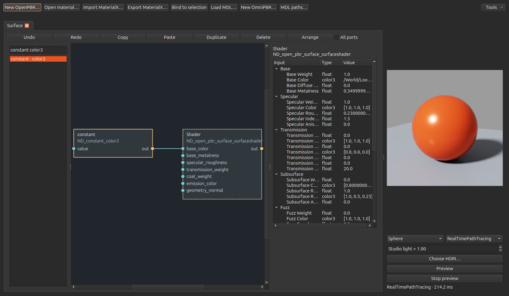
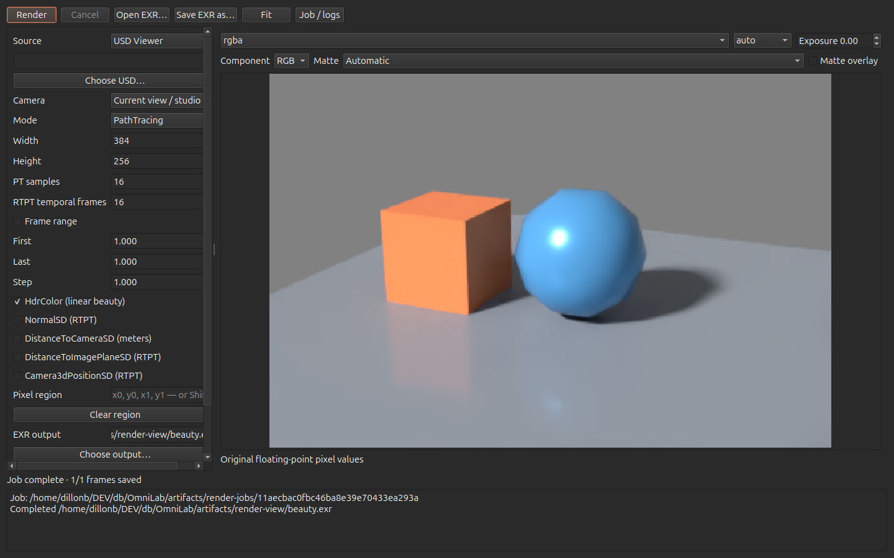

# OmniLab

A USD editor with Qt and optional standalone ovUI frontends using NVIDIA ovstage and ovRTX, MaterialX/OpenPBR and native MDL material graphs, interactive previews and a final RenderView. The P2–P6 core workflows are implemented; [Qt release-parity limits](docs/P2_P5_STATUS.md) and [ovUI status](docs/P6_STATUS.md) remain explicit.

The agreed direction is **Qt first, ovUI second**, with one shared document/command core. OpenUSD owns editable documents and composition; isolated workers own **ovstage + ovRTX**. **MoonRay graph conversion is P7, low priority**.

## Run

Linux x86_64, Python 3.12 and a supported NVIDIA RTX GPU/driver are required for rendering. Authoring can run without the renderer.

```bash
uv sync --python 3.12 --extra rtx --extra dev
.venv/bin/omnilab --demo
.venv/bin/omnilab /path/to/scene.usda
.venv/bin/omnilab --no-render --demo
```

To install and launch the optional P6 frontend:

```bash
uv sync --extra rtx --extra dev --extra ovui
.venv/bin/omnilab-ovui --demo
```

In ovUI, **Appearance** in the top toolbar selects **OvGear Dark / Light** or **Showcase Orange / Blue / Teal**, plus independent **Compact / Comfortable** density. Apply updates open panels immediately and saves your preference across launches; Restore defaults selects Dark/Compact for the next Apply.

Both frontends show **three numeric fields followed by a color-picker square** for `color3f` values in the property inspector, Material Editor and RTX settings. Right-click a property value for **Copy values**, including the complete vector. In the Stage tree, right-click a prim for **Copy Prim → Name / Path / Type / Properties**; Properties copies JSON attributes, connections and relationships. **Select prims with bound material** appears when the clicked prim has an effective binding, and selects all prims sharing it, including inherited bindings. **Duplicate → As New Prim / As Instance** offers the two duplication modes.

[ovUI launch, controls, validation and remaining parity work](docs/P6_STATUS.md). The controls described below refer to Qt.

The editor retains USD layers, edit targets, transforms, typed properties, composition arcs, variants, bindings, undo/redo and composition-preserving saves. `.omnilab` projects also retain session layers, mute/load state, material tabs/studios and renderer settings. Asset publishing is a separate composed-content operation.

- **Viewport:** Alt+left drag orbits, middle drag pans, wheel dollies. F frames selection; Shift+F frames all. **W/E/R** select Translate arrows, Rotate rings or Scale boxes from the viewport or Stage tree, update the toolbar and focus the viewport. Drag an axis or ring to author a transform: the preview updates immediately, release commits one edit, Escape cancels. A bottom-right XYZ orientation gizmo follows the camera; **Edit → Application Settings → Show viewport orientation gizmo** controls its visibility. Camera guides draw a wireframe body and frustum. **Edit camera** makes navigation author the selected USD camera. View → Restart renderer recovers without discarding edits.
- **Timeline:** **View → Show Timeline** toggles the bottom scrubber between Frame and Range. Drag to scrub, use arrow keys to step a frame, or enter a fractional frame directly. Scrubbing pauses playback. Visibility persists between launches.
- **Properties:** float/double values use inline spin boxes; vectors have one field per component and colors include a picker swatch. Enter or leaving a field commits an undoable edit; Escape cancels. **Edit → Application Settings** (also Material Editor → Tools) controls float/double decimal places (defaults **6/12**) and **Show property types** for property tables/trees, including the ovRTX settings tree. Preferences persist outside scene files; changing precision never rounds stored USD values. The main Properties sidebar can shrink to **240 pixels**, with scrolling for wider content.
- **Transform authoring:** **Quaternion** below Rotate XYZ switches to W/X/Y/Z fields; Apply normalizes nonzero quaternions. **Output as matrix** writes Apply and viewport drags as a single active `matrix4d` xform op. Existing default/key poses and reset-stack state are retained; interpolation between keys may change. Both choices persist in `.omnilab` projects. See [transform and gizmo details](docs/MATERIAL_EDITOR_STATUS.md#quaternion-matrix-output-and-gizmos).
- **Display:** Shaded, native Shaded Wireframe, native Unlit Wireframe, Wire over Shaded, and Points. The latter two use native depth with bounded CPU mesh overlays; see their geometry limits in the status document.
- **Material Editor (Ctrl+M):** separate **OpenPBR**, **MDL** and **MaterialX** menus and node-library tabs, typed port dragging, grouped inputs, bindings, `.mtlx` import/export and graph-local undo. Long shader identifiers elide inside the inspector; hover for the full identifier. Start Preview for the native studio. Drag the preview to orbit; middle drag pans; wheel dollies. Tools provides map/blur baking and live/frozen camera projectors.
- **Relaunch OmniLab:** File → Relaunch OmniLab (also Material Editor → Tools) starts a fresh process to load code changes, restoring unsaved document edits, the original save destination, selection/time, material tabs/studios and console text. Undo history and Python execution state start fresh. Finish or stop an active Python cell/final render and wait for MDL loading before relaunching. A durable checkpoint remains under `$XDG_CACHE_HOME/omnilab/relaunch` (normally `~/.cache/omnilab/relaunch`); relaunch does not overwrite the original scene file.
- **RenderView (F6):** render the viewer, material studio or a USD file to linear multichannel EXR. Set fractional frame ranges, supported AOVs and pixel regions. Shift-drag the image to select a region. Inspect layers/components/mattes and original float pixels; save the original EXR with all channels intact. Final jobs pause the interactive renderers and resume them afterward.
- **Python Console (F8):** explicit script execution in a cancellable worker. Successful cells apply as one undo transaction; errors, Stop or a conflicting document edit leave the main document intact.





## MDL and automation

File → New MDL demo uses the installed ovRTX OmniPBR module. For reflected/custom MDL graph editing, install the optional SDK adapter:

```bash
.venv/bin/python tools/setup_mdl_sdk.py
```

This downloads the checksum-pinned NVIDIA MDL SDK into `.cache/mdl-sdk` and installs its matching Python 3.10 interpreter through uv. Alternatively, set `OMNILAB_MDL_SDK` and `OMNILAB_MDL_PYTHON`. Load modules and set search roots in the Material Editor. Successful modules are cached with imports/resources bundled; a failed reload retains the last valid material. SDK assets remain outside the repository.

MCP is optional and starts stopped:

```bash
uv sync --extra rtx --extra dev --extra mcp
.venv/bin/omnilab-mcp
```

Enable **View → Start MCP** in the editor and configure the stdio command above in your MCP client. It exposes the same document, graph, preview, final-render and export services, with revision checks for edits. Stop MCP removes the private local endpoint.

## Validation and settings

```bash
.venv/bin/python -m pytest -q
.venv/bin/omnilab-probe --output artifacts/p0
.venv/bin/python tools/replay_qt.py
```

[Full P2–P5 validation and reproduction commands](docs/P2_P5_STATUS.md) include native GPU material, EXR/region, projector/bake, Qt and MCP tests. The original [P0–P2 report](docs/P0_P2_STATUS.md) is retained as historical evidence.

[Material Editor layout and relaunch validation](docs/MATERIAL_EDITOR_STATUS.md) records the subsequent Qt improvements and native restart check.

**View → Inspect all ovRTX settings** opens typed viewport/material/final overrides and renderer-creation controls. Export all settings writes declarations, authored values, source versions and explicitly unknown effective values. Full extracted inventories remain available:

- [Complete settings catalog](docs/settings/OVRTX_SETTINGS.md): 828 declarations / 826 unique RTX names.
- [JSON](docs/settings/ovrtx-settings.json), [CSV](docs/settings/ovrtx-settings.csv), and [C creation options](docs/settings/ovrtx-c-configuration.csv).
- [Implementation plan](docs/IMPLEMENTATION_PLAN.md) and [Lunatic parity matrix](docs/LUNATIC_PARITY.md).
- [Evidence](docs/EVIDENCE.md) and [Lunatic source reuse/hashes](docs/LUNATIC_REUSE.json).
