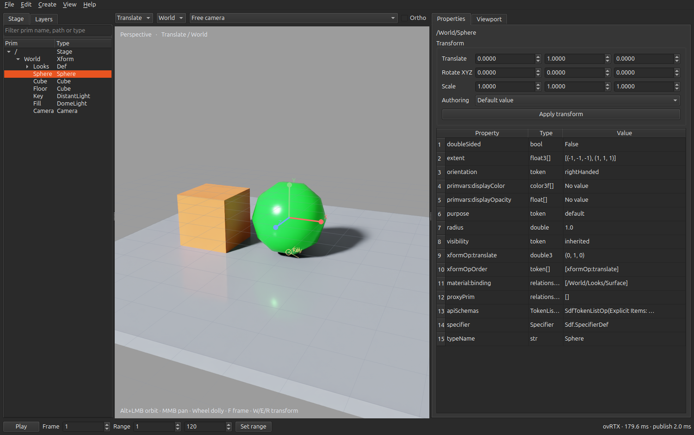

# OmniLab

A Qt USD editor using NVIDIA ovstage and ovRTX. The initial P0–P2 implementation runs; the full Lunatic reproduction remains in progress.

The agreed direction is **Qt first, ovUI second**, with one shared editor core. OpenUSD owns editable documents and composition; an isolated worker owns **ovstage + ovRTX**. The viewport renders **OpenPBR through MaterialX** and **MDL**. Material graph editors are P3/P4; MoonRay graph conversion is **P7, low priority**.

## Run

Linux x86_64, Python 3.12, a supported NVIDIA RTX GPU and driver are required for rendering. The Qt editor can run without the renderer.

```bash
uv sync --python 3.12 --extra rtx --extra dev
.venv/bin/omnilab --demo
# Or open a document:
.venv/bin/omnilab /path/to/scene.usda
# Authoring only:
.venv/bin/omnilab --no-render --demo
```

Use File → New MDL demo to try the SDK's bundled OmniPBR material. The module remains in the installed SDK; it is not redistributed here.

The editor supports stage/layer inspection, typed property and transform editing, local edit targets, undo/redo, variants, composition arcs, primitive creation, duplication, rename/reparent, material binding and composition-preserving USD saves. `.omnilab` projects also retain session layers, mute/load state and viewport preferences.

Alt+left drag orbits, middle drag pans, and the wheel dollies. F frames selection; Shift+F frames the scene. W/E/R select translate/rotate/scale; drag an axis, or Escape to cancel. Click/rectangle selection uses native picking. View → Restart renderer recovers a stopped worker without discarding edits.

Choose Viewport → Display → Wireframe for native ovRTX wireframe in either RTPT or PT. It shows triangulated render geometry, including implicit spheres and cubes. `.omnilab` projects retain the display mode.



## Validation and scope

```bash
.venv/bin/python -m pytest -q
.venv/bin/omnilab-probe --output artifacts/p0
.venv/bin/python tools/replay_qt.py
```

The probe renders real GPU images and saves a package/GPU manifest. The desktop replay exercises actual Qt input, native picking, manipulator undo, material deltas, stale-frame rejection, cancellation and recovery. It opens temporary windows and writes evidence under `artifacts/`.

See [P0–P2 status](docs/P0_P2_STATUS.md) for tested coverage and remaining work. In particular, the graph editors, full RenderView and ovUI frontend are not implemented. The Points display uses a CPU mesh overlay without depth occlusion.

- [Implementation plan](docs/IMPLEMENTATION_PLAN.md)
- [Lunatic behavior and migration matrix](docs/LUNATIC_PARITY.md)
- [Complete extracted ovRTX settings catalog](docs/settings/OVRTX_SETTINGS.md)
- [Machine-readable settings](docs/settings/ovrtx-settings.json) and [CSV](docs/settings/ovrtx-settings.csv)
- [C creation options](docs/settings/ovrtx-c-configuration.csv)
- [Evidence and reproduction](docs/EVIDENCE.md)
- [Lunatic source reuse and hashes](docs/LUNATIC_REUSE.json)

The catalog contains all extracted declarations for the pinned SDK, including settings not yet validated at runtime. Viewport → Inspect all ovRTX settings opens a searchable table; the checked-in CSV/JSON remain the complete output.
