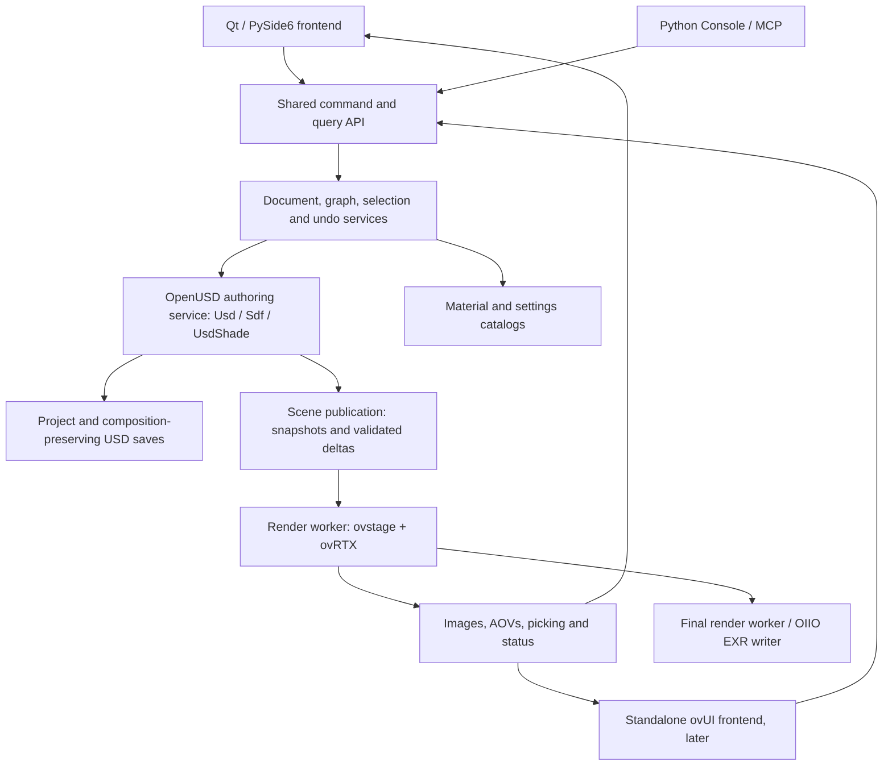

# OmniLab implementation plan

Prepared 2026-10-02. User decision: retain Lunatic's Qt frontend for the first version; add standalone ovUI as a second frontend.

## Proposed application

Build a USD authoring application that preserves Lunatic's workspaces and interaction rules: USD Viewer, Material Editor, RenderView, Logging, Python Console and optional MCP control. Replace its MoonRay rendering and shader infrastructure with ovRTX and ovstage. Keep document operations, selection, commands, history, project persistence and material models independent of either UI toolkit.

Use OpenPBR as the default surface model, represented by MaterialX networks. Add native MDL materials and parameter editing alongside it. OpenPBR is a material model, MaterialX is a graph/interchange system, and MDL is a material language; these are complementary layers. NVIDIA documents OpenPBR's MaterialX implementation being translated to MDL for rendering. Its public renderer documentation also describes mode-dependent limitations, so the UI must distinguish material-model support from support for each effect in the selected mode. [NVIDIA OpenPBR documentation](https://docs.omniverse.nvidia.com/materials-and-rendering/latest/templates/OpenPBR.html)

The target is the same editing behavior and comparable workflows. MoonRay and RTX use different shading implementations, sampling, light models and outputs; identical pixels and arbitrary MoonRay shader/LPE compatibility are not acceptance criteria. Any omitted behavior remains visible in the parity matrix until implemented, replaced with an accepted equivalent, or explicitly deferred.

## Evidence and baseline

The reference is the **current working tree** at `/home/dillonb/DEV/astra_tests/moonray_tests/lunatic`, including its uncommitted changes. Its HEAD is `5b9421a3b1866ea55e46c273d7ee3a46440f5dd5`. A clean clone at HEAD alone would omit behavior inspected for this plan. Preserve and fingerprint the working tree before the implementation fork. The source was inspected without changing it.

The local public ovRTX checkout identifies release **0.5.0**, commit `e3ebb35a6024d070fe21125f3806d6152ed3c753`; the inspected package is **0.5.0.377615**. Its Python `RendererConfig` source matches the checkout byte-for-byte. Pair it with the compatible **ovstage 0.2** release train and record exact build versions during P0. Public version information also identifies ovRTX 0.5.0. [ovRTX version](https://github.com/NVIDIA-Omniverse/ovrtx/blob/main/VERSION.md)

NVIDIA provides a Qt material-editor sample with MaterialX rendering and live parameter changes. Its graph is read-only, it uses deprecated renderer-owned scene APIs, and it is not a full USD editor. Reuse the integration lessons; build OmniLab around the current attached-stage API. [Sample documentation](https://github.com/NVIDIA-Omniverse/ovrtx/blob/main/docs/examples/c_material_editor.rst)

This plan is based on source, schema and documentation inspection. It does not claim successful GPU rendering, a tested binary combination, or complete live application parity. [Evidence manifest](EVIDENCE.md)

## Architecture



**OpenUSD owns durable authoring.** The authoritative document retains root/session layers, edit targets, sublayers, references, payloads, variants, load rules, muting, time samples, collection bindings and custom metadata. ovstage owns the derived runtime scene used by ovRTX. Runtime writes alone do not constitute saved edits. Undo is implemented through document commands, never by treating ovstage ordinals as historical document snapshots.

**Use an isolated rendering worker initially.** The target is a Qt application process containing the shared core and OpenUSD authoring service, plus a persistent ovstage/ovRTX render worker. Keep OIIO in a compatible image-I/O worker if necessary. Lunatic's existing separate USD authoring worker can remain during the first extraction, but it must remain the single document owner until replaced. Current ovRTX releases vendor namespaced OpenUSD libraries and document coexistence with external OpenUSD; worker isolation is a choice for crash recovery, cancellation and packaging, not a claim that modern ovRTX inherently cannot coexist with `pxr`. Do not carry MoonRay's old Python 3.10/Qt5 stack into the new renderer. [ovRTX release notes](https://github.com/NVIDIA-Omniverse/ovrtx/blob/main/CHANGELOG.md)

The first implementation should use Python 3.12 for the application services and retain PySide6 6.8.3 initially, subject to P0 packaging checks. Pin the authoring service's OpenUSD/MaterialX combination separately from the renderer worker. The NVIDIA example references OpenUSD 25.11 with MaterialX/Sdr support; choose a proven build after testing current Lunatic APIs. A random `usd-core` wheel is not proof of a complete MaterialX node registry.

Start with copied CPU image buffers and bounded shared-memory transport. It is simpler to validate than cross-process GPU handles. At 1920×1080 RGBA8, one image is approximately 8.3 MB; 30 frames/s is approximately 249 MB/s before extra copies. Measure latency and memory traffic before deciding whether an in-process matching ABI or Vulkan/CUDA interop is justified. Do not couple Qt presentation code to renderer-owned pointers.

The optional ovUI executable hosts the same headless core and document service and speaks the same renderer protocol. Adapt its stage/property/layer widgets to that service, rather than opening a second independently editable stage with a second undo stack. Commands can be called directly inside the application process; IPC is only needed across actual process boundaries.

### Command and synchronization contract

1. A user, console or MCP action invokes the same typed command. Record document ID, command ID, edit target and time context.
2. Validate the command against USD composition and material types, author the change, and commit one undoable transaction. A drag produces one undo entry; Escape restores the starting values.
3. Assign a monotonically increasing document revision. Publish a coherent runtime update associated with that revision.
4. For verified scalar/transform/material-parameter changes, update the derived ovstage data at a new ordinal. For composition, shader topology, reference, variant or load-rule changes, initially rebuild from a composition-preserving temporary USD snapshot. Optimize incremental structural edits only after correctness is proven.
5. Complete the writes, seal the publication as required, and step the selected **RenderProduct paths**, using the published ordinal. Use the 0.5 attached-mode lifecycle and current DLPack output API. [ovRTX minimal example](https://github.com/NVIDIA-Omniverse/ovrtx/blob/main/examples/python/minimal/main.py)
6. Tag results with document revision, worker generation, product, camera, time and dimensions. Discard stale frames and picks. Release every output mapping before reuse or worker teardown.

Dirty source layers and anonymous session layers must be represented in snapshots; reloading only the original file would lose unsaved edits. Preserve per-layer asset anchors and sublayer offsets. Runtime snapshots are temporary artifacts; ordinary Save must not flatten composition. A final render takes an immutable revision snapshot so later viewport edits cannot alter the job.

Convert USD timeline values to the time units expected by the selected population API. Treat `timeCodesPerSecond`, frame number, shutter interval and renderer `delta_time` as distinct quantities. Animation acceptance includes fractional frames and cameras with animated transforms.

Use a persistent preview/viewport renderer where possible. Separate final rendering into a worker for reliable cancellation and isolated snapshots, scheduling jobs to avoid uncontrolled GPU/VRAM competition. Do not assume one ovstage can be attached to two renderers simultaneously; the inspected Python API explicitly forbids that. A second renderer needs its own compatible stage instance.

### Proposed code boundaries

```text
src/omnilab/
  core/                 commands, events, documents, selection, capabilities
  usd/                  authoring, composition, layers, bindings, persistence
  materials/            graph model, MaterialX and MDL providers, conversion
  render/               backend contract, products, settings, jobs, color
  backends/ovrtx/       ovstage publication, stepping, picking, readback
  ipc/                  versioned messages, revisions, shared frame buffers
  frontends/qt/         Lunatic-derived widgets and presenters
  frontends/ovui/       later frontend and widget adapters
  automation/           console and MCP command adapters
  workers/              authoring, render and image-I/O entry points
tests/
  parity/               workflow and document contracts shared by both UIs
  gpu/                  actual ovRTX images, materials, settings and recovery
  fixtures/             portable USD/material and composition fixtures
```

This is a proposed layout, not an existing implementation. Extract responsibilities incrementally from Lunatic; many modules still import MoonRay-specific catalogs or workers, so file copying is only a starting point.

## Material editor

| Path | Intended role | Required implementation | Evidence and limit |
|---|---|---|---|
| OpenPBR / MaterialX | Default material authoring | Searchable NodeDef catalog, typed graph connections, textures, UVs, preview, USD and MaterialX round trips | OpenPBR and MaterialX libraries exist in the inspected package; every required node/effect still needs rendering tests |
| MaterialX Standard Surface | Compatibility for existing assets | Preserve shader IDs and authored graph structure; optional reviewed conversion to OpenPBR | NVIDIA's MaterialX sample establishes a practical integration path, not universal node coverage |
| Native MDL | NVIDIA materials, presets and custom MDL modules | Module/search-path resolution, source/subidentifier preservation, parameters and annotations, compile diagnostics, caching | Bundled MDL assets and release notes establish support; arbitrary MDL graph editing is a separate feature |
| UsdPreviewSurface | Interchange and simple fallback | Preserve/import simple USD networks; author an optional universal preview terminal | Must remain a declared approximation of richer materials |
| MoonRay graphs | Migration from Lunatic | Retain original network data; explicit conversion report and optional texture baking | No assumed binary/semantic equivalence to MDL or MaterialX |

The inspected package includes `library/materialx/bxdf/open_pbr_surface.mtlx`, MaterialX MDL-generation definitions, `library/mdl/OpenPBR/open_pbr_uber_base_class.usda`, and OmniSurface MDL modules. These are stronger evidence than assuming standalone ovRTX exposes every feature of Kit's material editor. The editor must still perform import, render, edit, undo, save and reopen tests against the pinned runtime.

**Graph model:** retain node IDs, names, positions, tabs, selection, clipboard and per-tab undo behavior. Replace the MoonRay `shader_json` catalog with separate MaterialX and MDL catalog providers. Each node records its source framework, implementation identifier, version, typed ports and metadata. Preserve unknown nodes and authored values for round-tripping even when they cannot render. Do not allow arbitrary MaterialX-to-MDL port connections; any bridge must be implemented and validated explicitly.

**MaterialX first:** expose OpenPBR base/specular/transmission/subsurface/coat/fuzz/emission/opacity parameters with standard image, UV, normal-map, mix and math nodes. Read supported definitions and annotations from the pinned MaterialX/Sdr libraries instead of inventing names or bounds. Store scene materials as UsdShade networks and bindings. Export standalone `.mtlx` where a graph is representable, carrying texture paths, colorspaces and node definitions. Unsupported USD-only constructs produce an explicit export report.

**MDL in two increments:** first load named module materials/presets and edit their declared inputs. Obtain reflection/annotations from a tested MDL catalog or supported SDK adapter, not a regex parser of MDL source. Preserve `sourceAsset`, subidentifier, textures, search roots and the MDL render terminal. Then add typed function-call graphs, module reload and generated module support as a separate milestone. The MDL compiler/runtime does not supply Lunatic's node-editing UI, undo or save behavior automatically.

**Mode support:** public OpenPBR guidance lists thin film and sheen limitations in Real-Time 2.0, with additional SSS configuration and bounce requirements. Treat those as test targets for the exact standalone release, not an unconditional claim about this package. Offer PathTracing preview for effects that need it, and display a capability notice on the affected node/control. [OpenPBR mode notes](https://docs.omniverse.nvidia.com/materials-and-rendering/latest/templates/OpenPBR.html)

**Preview and baking:** reproduce Lunatic's sphere/object previews, HDRI/light controls, camera matching, auto-render debounce and per-node texture previews. Add scene-aware and isolated swatches as distinct operations. UV-card and motion-blur map baking require a real replacement pipeline and atomic EXR output; they cannot be implemented by renaming MoonRay bake nodes. General mesh/UDIM baking is already a future plan in Lunatic and is not a first-release parity requirement.

**Migration:** support reviewed conversions for simple base color, metalness, roughness, IOR, opacity, normals and texture inputs. Handle roughness conventions, units, colorspaces, normal orientation and displacement scale explicitly. Layering, Dwa-specific lobes, procedural maps, hair, volumes, projectors and light/display filters need per-feature mappings or baking. Preserve source materials and other renderer terminals; author converted materials and binding overrides in a new layer with one undo transaction. A filename import succeeding must not be presented as successful shader conversion.

## USD editor and persistence

Port the existing layer-aware services before changing the viewport. Preserve New/Open/Save/Save As, project saves, edit-target choice, dirty tracking, root/session distinctions, anonymous layers, sublayer ordering/offsets, muting, references, payloads, variants, composition inspection, namespace operations, abstract prims, duplication, transforms, custom properties, metadata and material bindings.

Keep the source's distinction between saving and asset publishing. Ordinary saves retain composition. Selected-prim publishing deliberately snapshots composed content and packages geometry/material/binding layers; its current-variant/instance-expansion limitations should remain visible.

Propose a versioned `.omnilabproj` format for new projects. It records UI/document state, graph layouts, external layer identities, snapshots of dirty/anonymous layers, render products, material framework IDs and pinned renderer configuration. Import `.lunaproj` and legacy `.moonrayproject` without overwriting them. Retain original MoonRay graph payloads as migration data. Store renderable scene/material data in USD; use project metadata for workspace state rather than making a new opaque scene format.

Keep authoring independent of renderer availability: document inspection, graph edits and saving should remain usable when the renderer fails or an RTX GPU is unavailable. Render actions report the failure and allow worker recovery.

## Viewport and RenderView

Replace Storm/MoonRay viewport rendering with ovRTX RTPT by default, with PathTracing and Minimal options according to tested capabilities. Preserve orbit/pan/dolly, perspective/orthographic cameras, frame selected/all, camera locks, up-axis conventions, selection, box picking, outlines, transform handles, time samples and purpose visibility. Geometry overlays such as grids, light/camera guides and gizmos belong to the editor, not saved scene geometry.

Wireframe-on-shaded and geometry-points modes need a dedicated implementation/prototype. Lunatic currently uses a Storm overlay for some MoonRay views; MinimalRendering is not automatically an equivalent wireframe mode. Do not silently remove these controls or suggest a supported mode that produces the wrong result.

Use separate RenderProducts for viewport, material preview and final output as needed. Keep resolution/camera/output settings product-specific. Apply shared scene/global settings consistently. For beauty export use linear `HdrColor`; `LdrColor` is the display path. Preserve HDR/negative source values in EXR inspection. OIIO handles channel naming, multipart reads and atomic EXR writing; ovRTX output arrays alone are not a finished RenderView.

The 0.5 PathTracing documentation says a step accumulates toward the configured sample limit before returning. Consequently, Lunatic's six-second checkpoint behavior cannot be assumed to arise from repeated `step()` calls. P0 must prove intermediate-image access, cancellation and status APIs. If checkpoints are unavailable, retain an interactive RTPT preview while a final worker runs and label it as preview, or implement a tested incremental final-render mechanism. Do not call a separate low-sample render a checkpoint of the final job. [PathTracing lifecycle](https://github.com/NVIDIA-Omniverse/ovrtx/blob/main/docs/sensors/cameras/render_modes/path_tracing.rst)

AOV parity is an explicit workstream. The public source documents HDR/LDR beauty for PathTracing and richer RTPT outputs including normals, distances and segmentation. Probe requested final-render outputs before exposing them. MoonRay LPEs, ExtraAovMap labels, arbitrary primitive/material AOVs, sample filters and Cryptomatte-style outputs are not guaranteed equivalents. Preserve unavailable project entries and explain them; never silently substitute a different quantity. Use metric distance outputs instead of deprecated raster `DepthSD` for a metric depth preset.

Render regions require crop-coordinate validation and merging with the prior per-frame/per-channel EXR baseline. Preserve pixels outside the region; new channels start black there. Maintain image-view controls during rendering and retain the last completed image on cancellation. A final output file is replaced only on successful completion.

## Settings system and delivered inventory

[The full catalog](settings/OVRTX_SETTINGS.md) contains **828 RTX schema declarations (826 unique names) in 28 groups**, **19 Python creation fields**, **20 active C configuration keys**, **2 retired C keys**, **56 standard camera/render declarations**, and **76 documented setting rows**. JSON contains descriptions, enums, raw defaults, groups, source paths/lines, source hashes and discrepancies. CSV is suitable for filtering and initial UI generation.

These are all declarations in the inspected renderer settings schema and public creation configuration. They are not all private engine switches, material inputs or LiDAR/radar model settings, and not measured effective values in a running renderer. A property can ship in a schema without working in standalone ovRTX.

Implement a settings registry with: exact attribute/key, type, schema default, documented default, authored value, effective value when readable, enum/range metadata when supplied, target prim, supported modes, capability evidence, restart/reset requirements, serialization policy and provenance. Unknown ranges stay unknown; do not invent slider bounds. Imported unsupported settings remain round-trippable.

The first settings UI should provide searchable groups and presets, with commonly used controls prominent:

- **Viewport:** mode, resolution scale, camera, samples/bounces, denoising, headlight, background and exposure.
- **Final:** resolution, product/camera, sample count, adaptive sampling, bounce limits, volumes, denoising, output variables, frame range and region.
- **Materials:** relevant transparency/SSS/emission controls and compile diagnostics.
- **System:** GPU selection, caches, texture/geometry streaming, motion BVH and logging; init-only controls clearly require worker recreation.
- **Advanced:** raw schema entries with evidence status, reset-to-default and authored-value inspection.

Two explicit default conflicts were detected: render-mode spelling and adaptive-sampling default. Nine documented names are absent from the packaged schema, including some spectral/cache controls and namespaced rendering colorspace. The registry must preserve those disagreements and settle them by version-specific rendering tests. It must not treat schema defaults as live runtime defaults. Public 0.5 removes `use_vulkan`; Vulkan is the package backend. Dome-MDL bake settings moved out of renderer creation and have scene-wide consequences despite their RenderProduct authoring location.

Add a future **Export settings** action that writes both the static catalog and a document snapshot: package/build IDs, selected products/cameras, authored values and layers, composed values, queried effective values or `unknown`, device IDs and application presets. This is the correct way to provide “all current settings” from a running OmniLab session.

## Delivery sequence and acceptance gates

| Phase | Work and dependencies | Exit evidence |
|---|---|---|
| **P0 — feasibility and pinned runtime** | Freeze Lunatic working-tree baseline; provision isolated Python/USD/MaterialX and ovstage/ovRTX environments; minimal renderer, picking, parameter edits, mode tokens, sample control, AOV and cancellation probes | Exact build manifest; saved and inspected real images; a supported/unsupported/unknown capability report; successful save/reopen for a small authored scene; measured publication/readback latency |
| **P1 — shared document core and Qt shell** | Port command/history, project persistence, layer/prim operations and frontend presenters; remove startup dependence on MoonRay shader metadata | Qt workspace opens without MoonRay; layer/variant/session/project round trips and undo tests pass; agreed shortcuts and dirty prompts match |
| **P2 — ovRTX viewport** | Persistent renderer, snapshot publication, scalar deltas, image transport, camera/navigation/picking/gizmos, purpose/time handling and overlays | Real desktop interaction replay; no stale frames after rapid scene changes; camera/selection/transform agreement; repeated open/close/worker recovery works |
| **P3 — MaterialX/OpenPBR editor** | Catalog, typed graph model, nodes/connections, bindings, swatches, preview studio, USD/MaterialX persistence and first migration recipes | Representative OpenPBR materials render correctly; edits/undo/save/reopen retain values, bindings and layout; missing nodes/textures give usable diagnostics |
| **P4 — native MDL** | Module/preset catalog, input editing, search paths, textures and compile diagnostics; then function-graph editing | Bundled and custom module material round trips; parameter edits visibly affect images; failed reload preserves last valid material; typed function graphs have independent coverage |
| **P5 — RenderView and complete feature parity** | Final jobs, color/EXR pipeline, supported AOVs, regions, frame ranges, status/cancel/recovery, baking, projectors and remaining migration features | EXR channel/value checks; no final-file replacement after cancellation/failure; region outside-pixels unchanged; parity matrix has no unaccounted first-release items |
| **P6 — optional ovUI frontend** | Implement frontend adapters over the accepted core, reuse appropriate ovUI widgets, port material canvas/RenderView/console | Same command-level suite and document round trips as Qt; separate real-input UI checks; no divergent document or undo ownership |

P0 is the first implementation task. Its thin slice should open a USD fixture in a small Qt window, render it through ovstage/ovRTX, select a prim, edit a transform and OpenPBR parameter, undo both, save layered USD, reopen and reproduce the authored result. Add one native MDL fixture and record RTPT/PT differences. This resolves the largest architectural assumptions before moving the whole application.

The sequence is dependency driven. Material catalog work can begin after P0 while the viewport is completed; final RenderView still depends on snapshot and output correctness. Do not estimate full delivery from a renderer demo: Lunatic already contains substantial composition, image inspection and graph behavior. Produce calendar estimates after P0 exposes the compatibility and performance work.

## ovUI second frontend

Standalone ovUI exists and does not require a Kit application. Its supplied widgets include scene, properties, layers, content and viewport components, with adapter interfaces. That makes it useful for the second frontend. [ovUI overview](https://github.com/NVIDIA-Omniverse/ovui)

Its current widgets document limitations including incomplete rotate/scale manipulators and large-stage UI concerns. Its native ovstage provider lacks durable new-document/save/export/layer-composition workflows and requires a matched native runtime cohort. Therefore, do not use that provider as OmniLab's durable document model. Build an adapter to OmniLab's authoring service and validate the installable package versions when P6 starts. Do not inherit old livestream source-build instructions as the baseline. [Widget requirements and limitations](https://github.com/NVIDIA-Omniverse/ovui/blob/main/ovui-widgets/README.md)

The second frontend should preserve command semantics, workflows, keyboard behavior and file results. Exact Qt pixel geometry and Qt stylesheets are frontend-specific. The material node canvas and RenderView still need implementation in ovUI even when a stock stage browser is available.

## Validation and remaining decisions

Preserve and adapt Lunatic's meaningful behavioral tests, especially composition, project persistence, layer saves, transforms, bindings, graph tabs/clipboard, render snapshots and cancellation. Keep pure document/model tests runnable without a GPU. Add GPU integration fixtures only where rendered evidence is necessary.

Compare visual references for camera framing, texture/UV orientation, roughness, glass, SSS, coat, emission, opacity, normal maps, displacement, instancing, animated transforms, hair and volumes. Use effect-specific tolerances and baseline images within a renderer version; do not use MoonRay pixel equality as the definition of success. Every final output records camera/time/product/settings/build identity.

Real desktop tests cover mouse gestures, focus-sensitive shortcuts, menus, docking and undo; offscreen widget tests do not alone establish interactive parity. Performance reports should cover a small studio asset and a large layered scene, including cold shader compilation, warm edits, cancellation latency, memory growth and renderer restarts.

The confirmed UI direction needs no further decision. P0 must resolve: exact compatible packages, MaterialX registry availability, MDL reflection path, durable-to-runtime synchronization cost, final-image checkpoint/cancellation support, required AOV coverage and wireframe/points implementation. Feature gaps discovered there become concrete decisions with evidence, rather than assumptions buried in a rewrite.
