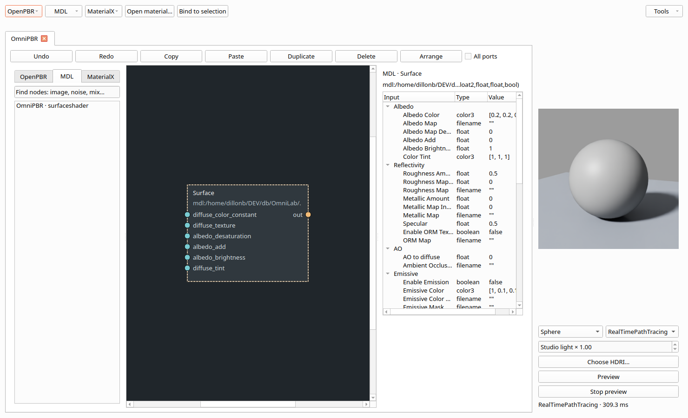
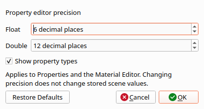
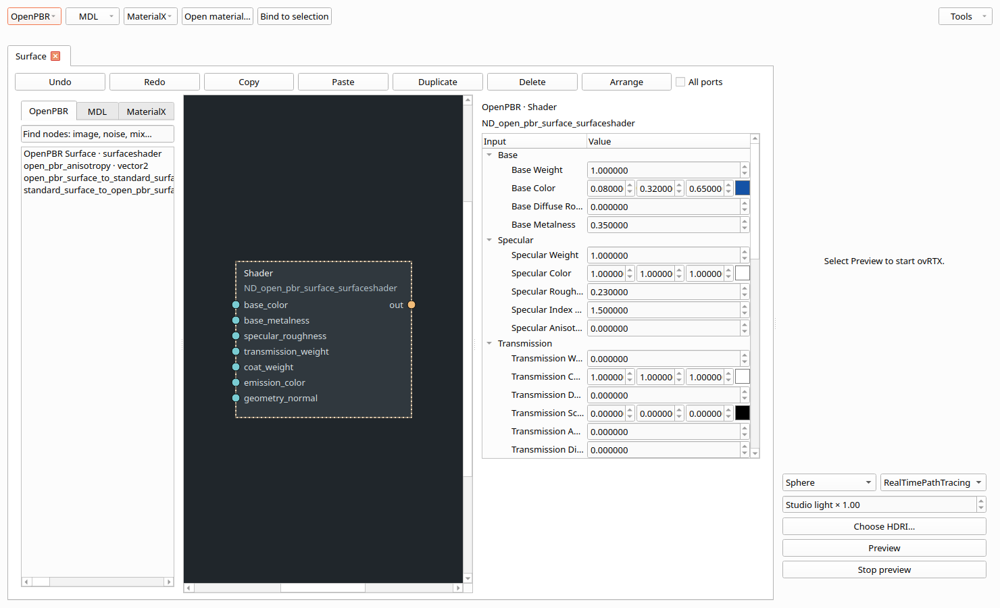

# Qt Material Editor layout and relaunch

2026-10-03. A live OmniPBR inspector was forcing the Material Editor to **3695 × 960** because the complete MDL function signature contributed to the label's minimum width. The signature now elides inside the inspector, with its full text available on hover. Library, graph, inspector and preview have independent splitter sizes. Preview images scale when the panel changes size. Initial graph framing waits for layout and avoids enlarging a single node beyond its normal size.

**OpenPBR**, **MDL** and **MaterialX** have separate creation/import menus and node-library tabs. The inspector identifies the selected node's family and retains its framework's parameter groups. OpenPBR remains authored through MaterialX; the extra section organizes its surface and helper definitions separately. Numeric display is compact while the tooltip and raw editor retain full precision.



## Relaunch

Use **File → Relaunch OmniLab**, or **Material Editor → Tools → Relaunch OmniLab**, after changing application code. It writes a private `.omnilab` checkpoint, launches the same Python environment and shuts down the old window's workers. The new process restores the current USD document, unsaved status, original save destination, selection/time, view settings, material tabs/studios and console text. It does not execute restored console text. Undo history and Python execution state start fresh; renderer processes are recreated. Active Python cells/final renders must finish or be stopped first, and an MDL load must finish.

Checkpoints remain under `$XDG_CACHE_HOME/omnilab/relaunch` (normally `~/.cache/omnilab/relaunch`) and can also be opened as ordinary projects for recovery. The original scene file is unchanged. A process-spawn failure keeps the old window open. If a subsequent startup fails because of a code error, the checkpoint is retained for recovery after repairing the code. Windows already running older code need one normal save-and-restart to acquire the new action.

## Validation

- **149 tests passed**: long reflected MDL identifiers and large preview images cannot force the tested window wider; framework filtering, checkpoint composition/edit-target/mute state, clean/dirty/untitled recovery, original-file preservation, active material tab, console text and spawn-failure behavior are covered.
- An isolated native X display exercised the actual reflected OmniPBR definition (463-character identifier), native ovRTX preview, node selection and all three framework tabs. The editor remained **1480 × 900**, then **1300 × 800**, with usable graph, properties and preview. [Layout measurements](evidence/material-layout.json).
- The existing native material replay passed library node creation, port dragging, preview updates, camera navigation, material tab isolation and a UDIM thumbnail. [Replay result](evidence/material-layout-regression.json).
- A mouse click on the real File-menu action launched a separate `python -m omnilab.app --resume-session … --no-render` process. The original window closed; the replacement showed its dirty document title and reopened Material Editor. The checkpoint retained edits, save path, selection/time and console text without executing it. Unit tests also inspect the restored widgets directly. [Restart result](evidence/relaunch.json).

Reproduce CPU checks with `.venv/bin/python -m pytest -q`. On an isolated X display (for example, Xvfb at 1600 × 1000), run:

```bash
.venv/bin/python tools/replay_material_layout.py
.venv/bin/python tools/replay_material_editor.py
.venv/bin/python tools/replay_relaunch.py
```

The first two need the installed RTX runtime and an NVIDIA GPU; the layout replay additionally uses the optional MDL SDK adapter. Relaunch acceptance uses `xwininfo` and `xprop` and terminates only its own replacement process. Full captures and test projects are under ignored `artifacts/`. These changes target Qt; the existing [ovUI scope and remaining differences](P6_STATUS.md) still apply.

## Inline values, application settings and viewport controls

The next Qt update adds `QDoubleSpinBox` cells for scalar floats/doubles and 2-, 3- and 4-component values, including USD float/double vectors and MaterialX vector/color inputs. Colors include a swatch opening the color picker; RGBA exposes alpha. Numeric fields preserve HDR values even when the display swatch is clamped. Connected material inputs continue to show their source. Enter or leaving a field commits one undoable edit; Escape cancels. Editing one component preserves the exact stored values of the other components.

**Edit → Application Settings**, also available from the Material Editor's Tools menu, opens a small preferences window. Defaults are **6 decimal places for floats** and **12 for doubles**. **Show property types** controls the Type column in the main Properties table, material parameter tree and ovRTX settings tree. Preferences use Qt's per-user settings and survive relaunch independently of projects. Changing display precision or focusing an unchanged field does not author rounded values to USD. The numeric precision preference applies to the property Value cells; existing transform-toolbar and timeline fields retain their own formats.

**W/E/R** now use the same Translate/Rotate/Scale selection as the toolbar, from the viewport or Stage tree. Selecting a tool focuses the viewport; dragging an axis authors a transform with one undo entry. Text entry and modified shortcuts are not intercepted. **View → Show Timeline** toggles a scrubber between the current-frame and range controls. Mouse scrubbing and one-frame arrow-key steps update the frame and pause playback. Fractional range endpoints are accepted by the shared range command. The main Properties tab can shrink to 240 pixels; scroll areas keep wider content accessible.

The updated CPU suite passes **169 tests**, including scalar/vector/color edits, no-op precision preservation, component isolation, color selection, local/global undo, application preference persistence, Type visibility, keyboard-selected transform authoring, fractional timeline scrubbing and narrow sidebar layout. Native input/GPU results are recorded in [editor-controls.json](evidence/editor-controls.json). Reproduce that check on an isolated display with `.venv/bin/python tools/replay_editor_controls.py`; its preferences are saved under ignored `artifacts/editor-controls` and do not change the user's defaults.





[Viewport, inline Properties and timeline capture](evidence/editor-controls.png).
