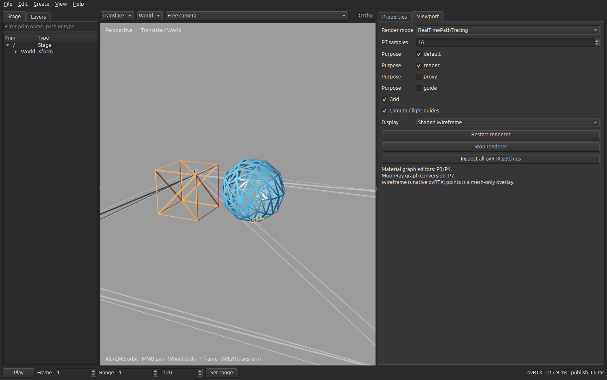
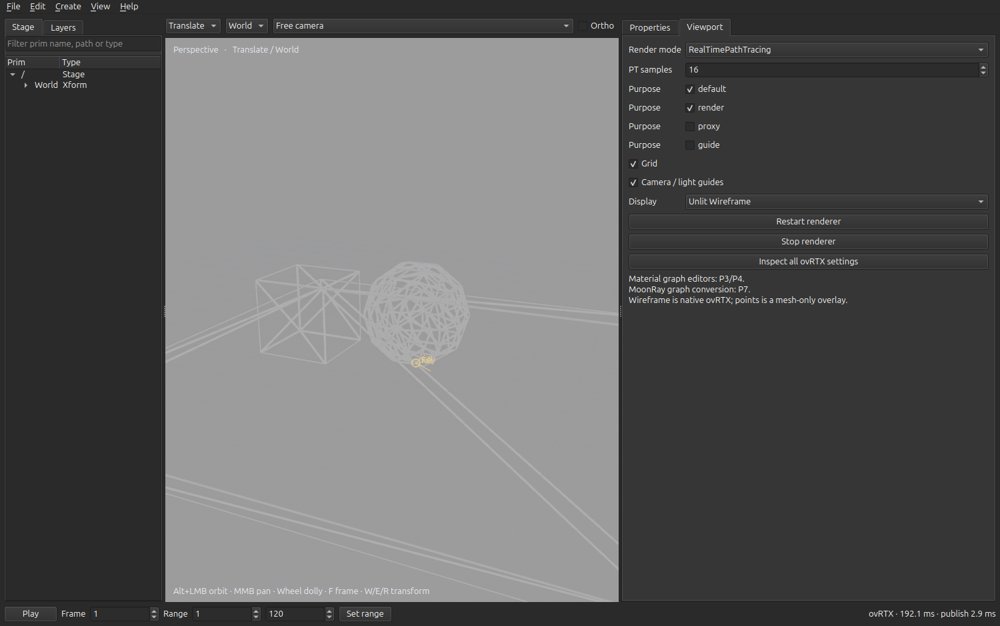
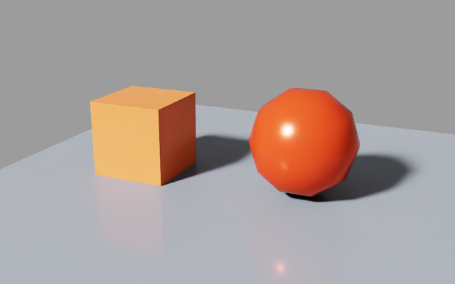
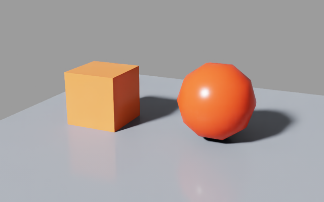

# P0–P2 implementation status

Historical report. The later [P2–P5 implementation](P2_P5_STATUS.md) supersedes its outstanding-work statements about graphs, RenderView, console, live gizmos, settings and depth overlays. Evidence below records the original P0–P2 baseline.

2026-10-02. **The first usable P0–P2 slice is implemented and GPU-tested. Full milestone acceptance and complete Lunatic parity are not claimed.** MoonRay graph conversion has moved to **P7 (low priority)**; it is no longer part of P3 or P5.

## What runs

| Area | Implemented and exercised | Remaining acceptance work |
|---|---|---|
| P0: runtime feasibility | Exact package pins and lockfile; real RTPT/PT/Minimal output; LDR/HDR/depth readback; native picking; camera and material updates; OpenPBR/MDL save/reopen; cancellation of an active PT step | Full asset/effect matrix, intermediate PT checkpoints, complete AOV coverage, install on a second machine, resolve the SDK MaterialX cache warning |
| P1: shared USD document and Qt | Root/session/local target ownership; typed properties; transforms; history; sublayers/offsets; variants; references/payloads; mute/load state; duplicate/reparent/rename; material binding; USD and project persistence; dirty prompts; stage, layer, properties and activity panels | Full Lunatic shortcut/dialog parity, Python console, external-change notices, extensive large-stage UX tests, all original UI tests |
| P2: native viewport | Persistent spawned renderer; snapshot publication; camera and verified shader color deltas; acknowledged CPU image transport; generation checks; scene/free cameras; orbit/pan/dolly; frame selected/all; native point/rectangle picking; native wireframe; transform gestures; purpose/frame evaluation; bounded cancellation and restart | Live rendered geometry during gizmo drag (currently preview handle, commit on release); broad delta coverage; depth-correct points; full light/camera shapes; full skeleton/instance interaction parity; optimized time updates; native outline visual acceptance |

The current shell uses the existing Qt/Fusion interaction style and ports Lunatic's USD routines. It does not load the old material canvas or MoonRay catalog. OpenPBR/MDL shader inputs can be edited in the typed property table before the P3/P4 graph editors arrive.

## Runtime and measurements

Tested on NVIDIA RTX PRO 6000 Blackwell Workstation Edition, driver **595.91.07**, Linux x86_64, Python **3.12.3**:

| Package | Pinned version |
|---|---|
| ovrtx | 0.5.0.377615 |
| ovstage | 0.2.0.377349 |
| usd-core | 26.8 |
| PySide6-Essentials | 6.8.3 |
| NumPy | 2.2.6 |

The [runtime report](evidence/p0-runtime.json) contains exact per-mode population/render/readback times at 640×400, output shapes/types and image-change measurements. These are small-fixture measurements, not large-scene performance claims. Warm runtime initialization was about 1.8 seconds; first-run shader compilation of the external NVIDIA minimal example took substantially longer.

The [desktop replay](evidence/qt-replay.json) passed on the actual desktop. It selected `/World/Sphere` by a projected click, performed a one-entry gizmo undo, changed OpenPBR color without snapshot reload, and presented **27 camera frames during a 1.06-second continuous mouse drag**, with a median presentation interval of **35.7 ms**. The final camera appeared about **107 ms** after release. The camera reused the worker and runtime snapshot. The same replay rejected 32 obsolete frames, interrupted an active 4096-sample PT request in about **0.32 seconds**, restarted in about **2.93 seconds**, and reopened the document three times. These are small-scene measurements; timing and stale-frame counts vary between runs.

The automated CPU suite has **76 passing tests**, including 64 adapted Lunatic regressions and 12 document/Qt integration checks. Slow-renderer scheduling tests cover progress during continuous input, bounded pending work, final-camera delivery and rejection of frames invalidated by scene changes. The GPU probe separately tests the actual renderer; CPU tests do not substitute for that evidence.

The [native wireframe check](evidence/native-wireframe.json) switched between Shaded, Shaded Wireframe and Unlit Wireframe on the actual Qt desktop in both RTPT and PT, retaining the renderer worker. The mean absolute RGB difference from the initial shaded image was over 14/255 in either wireframe mode and below 0.1/255 after restoring shaded. Both wireframe choices survived saving and reopening an `.omnilab` project without marking the USD document dirty. Legacy projects saved as Wireframe reopened as Shaded Wireframe.

The temporary RenderProduct authors `omni:rtx:wireframe:enabled`, `omni:rtx:wireframe:mode` (`shaded` for material/lighting on edges, `emissive` for unlit lines) and `omni:rtx:wireframe:thickness` (1.5). Returning to Shaded explicitly disables wireframe. These settings do not modify saved USD geometry or materials.









Both fixtures were saved with red material inputs, reopened and rendered. A subsequent native parameter write changed the sphere to green, verified numerically at its projected center. The report includes RGB measurements. This validates these inputs and modules, not every MaterialX node or arbitrary MDL function graph.

## Publication and persistence contracts

- The application owns `pxr.Usd.Stage`; the native worker imports ovRTX/ovstage. The authoring process never initializes the renderer.
- Normal USD saves preserve composition and dirty dependencies through Lunatic's save logic. Explicit flattened export is a separate action. `.omnilab` retains session layers, edit target, mute/load state, selection, frame and view preferences.
- Viewport publication deliberately flattens the current composed, loaded, unmuted view into a **temporary render-only snapshot**. This is not the saved document. Assets are anchored during USD flattening. Large scenes still need a more incremental publication path; current flattening runs in the Qt process and can pause it.
- View updates use a 16 ms throttle that input events cannot postpone. At most one submitted view waits for its first frame; newer camera inputs replace pending state. Camera-only motion may present monotonically newer intermediate frames so rendering continues during a drag, while scene/settings/selection changes immediately invalidate older frames and picks require the exact current view. Worker epochs reject output after restart. Only one output frame awaits acknowledgment. Camera writes retain the renderer's simulation clock and temporal history.
- Free-camera matrices/intrinsics and the two verified shader color inputs use native ordinal writes. Writes complete and the write floor advances before stepping. Other edits, undo, time changes and structural changes publish a new snapshot. The renderer persists while the attached runtime stage is rebuilt.
- Runtime snapshots live in an owned temporary directory and are removed on normal close. They currently accumulate during a long session; incremental retirement and crash-cleanup are follow-up work.
- A native PT step can block. Stop terminates only the owned worker, preserving the authoring document and last displayed image. Restart constructs a new renderer. This is not a graceful native checkpoint/cancel implementation.
- LdrColor is presented as the SDK's display image; no second display transform is applied. HDR/depth values are read by the probe, not yet exposed through a full RenderView/EXR workflow.

## Observed boundaries

1. **Minimal + HDR/LDR together:** the tested SDK combination emitted a tonemap error and returned stale color. Minimal succeeds with LdrColor alone in a fresh renderer. The UI exposes RTPT and PT only until mode-switch/output combinations are hardened.
2. **Authoring MaterialX registry:** `usd-core` 26.8 lacks the OpenPBR Sdr node definition here. The renderer successfully consumes the authored MaterialX graph using its own assets. P3 still needs a versioned catalog/provider; a functioning render is not proof of authoring reflection support.
3. **MaterialX cache:** the SDK reports that it cannot create `/usr/bin/cache/rtx.materialx/...` with this system Python installation. Rendering still succeeds, but cache location/packaging requires a supported fix. No system-directory permissions were changed.
4. **MDL resolution:** the demo authors the installed SDK module's absolute asset path. Save/reopen succeeds on this installation. Copying a project to another machine requires preserving or remapping that dependency; the SDK module is not bundled into the repo.
5. **Overlay parity:** native wireframe shows triangulated render geometry, including quad diagonals and implicit spheres/cubes. Shaded Wireframe shades the edges; filled surfaces with a wire overlay and original polygon edges alone remain unimplemented. Points remains a CPU mesh overlay, skips meshes above 100,000 points and stage traversal after 10,000 prims, and does not test occlusion. Gizmos edit the first selected prim. Unsupported imported transform/lock cases use Lunatic's validation and preserve original stacks.
6. **UI and native errors:** worker logs are inspectable during the session; the acceptance tools save copies. A worker failure is shown and requires explicit Restart. Automatic retry is intentionally bounded to user-directed restart.

## Reproduce

From the repository root:

```bash
uv sync --python 3.12 --extra rtx --extra dev
.venv/bin/python -m pytest -q
.venv/bin/omnilab-probe --output artifacts/p0
.venv/bin/python tools/replay_qt.py
.venv/bin/omnilab --demo
```

For this workstation the environment was created with `--python /usr/bin/python3` (3.12.3). The optional `--no-render` flag keeps the authoring UI usable without a GPU runtime. Evidence reports and selected PNGs are checked in; SDK binaries, caches, local environments and full logs are ignored. The original Lunatic checkout was not modified. [Source hashes and adaptations](LUNATIC_REUSE.json) identify the copied routines and tests.
