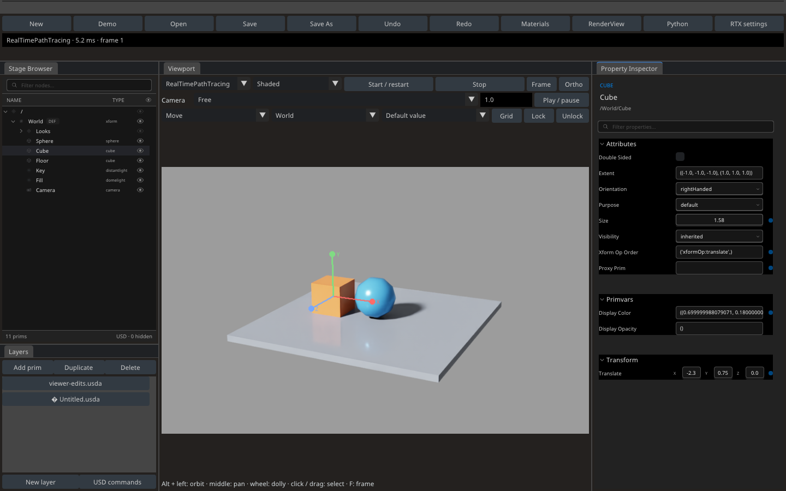
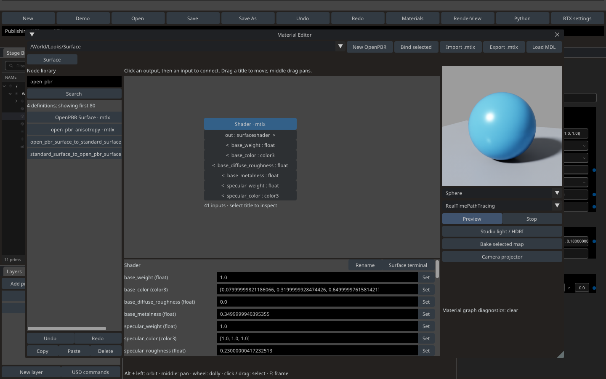
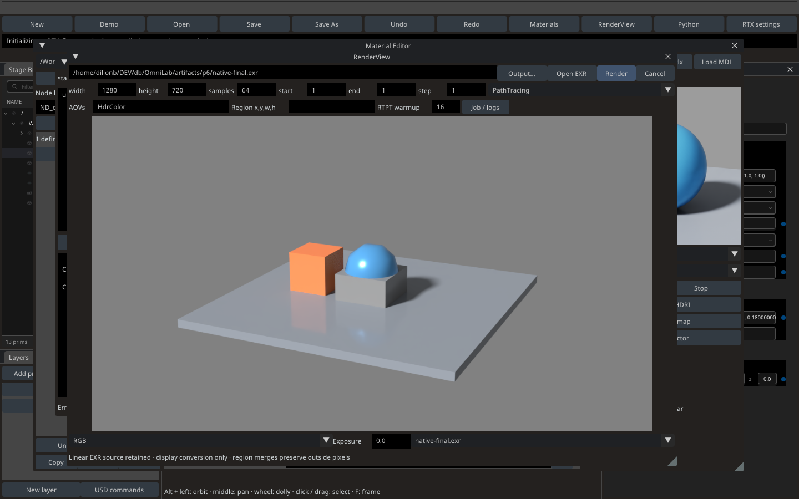

# P6 — standalone ovUI frontend

2026-10-02. The optional **`omnilab-ovui`** executable implements the P6 core workflows over the same `Document`, USD commands, material graphs and render jobs as Qt. The default `omnilab` executable remains Qt. Full Lunatic UI parity remains a separate acceptance gate; the remaining differences are listed below. MoonRay graph conversion remains P7.

## Install and run

```bash
uv sync --python 3.12 --extra rtx --extra dev --extra ovui
.venv/bin/omnilab-ovui --demo
.venv/bin/omnilab-ovui /absolute/path/to/project.omnilab
.venv/bin/omnilab-ovui --demo --no-render
```

The supported environment is Linux x86_64, Python 3.12, an X display/OpenGL context, and a supported NVIDIA RTX GPU/driver for rendering. `--no-render` permits authoring without starting ovRTX; ovUI still needs a display context. The ovUI application imports neither Qt nor ovRTX/ovstage: the latter run in owned child processes. Qt remains an installed dependency for the original executable.

The native core is **ovui 0.2.0**. NVIDIA's common/services/OpenUSD data adapters and common/stage/property/content widgets are installed from commit **`a81db103a4d99ff2d75368a444e167889536ff42`** of [NVIDIA-Omniverse/ovui](https://github.com/NVIDIA-Omniverse/ovui/tree/a81db103a4d99ff2d75368a444e167889536ff42). The pure Python widget distributions are separate from the native wheel. Their source dependencies are pinned in `pyproject.toml` and `uv.lock`. OmniLab supplies its existing OpenUSD 26.8 environment; it does not install the upstream sample's alternative USD runtime.

Dock positions persist in `$XDG_CONFIG_HOME/omnilab/ovui/imgui.ini` (normally `~/.config/omnilab/ovui`). Use `--reset-layout` to recover the initial arrangement. New/Open prompts before discarding dirty USD. Closing the native window writes a `recovery-<timestamp>.omnilab` beside the layout when the document has unsaved USD edits. Reopen that file normally to recover the edits. Save explicitly to retain presentation-only changes.

The ovUI process uses this configuration directory as its working directory for the SDK's layout persistence. Use absolute filesystem paths in Python console scripts; scene/project asset anchors are retained independently.

## Implemented workflows

| Area | Implementation |
|---|---|
| Stage and properties | NVIDIA Stage Browser and Property Inspector read the authoritative OpenUSD stage. Rename, reparent, visibility and property commits use OmniLab transactions. Group visibility/reparent edits and multi-selection properties produce one undo step; failed batches roll back. F2 renames and Delete removes selected stage prims. |
| Layers and documents | Edit-target selection, sublayer creation, mute/unmute, prim creation/duplication/deletion, native file picker, composition-preserving USD and `.omnilab` save/reopen, document Undo/Redo. The USD commands form exposes the shared typed command service using JSON arguments. |
| Viewport | RTPT/PT, native shaded and unlit wireframe, free or locked USD camera, perspective/orthographic, frame selected/all when nothing is selected, orbit/pan/dolly, fractional timeline and playback, native picking/marquee/outlines. World/local move/rotate/scale handles use shared pose math, preview deltas, transform locks, default/time-sample authorship, one release transaction and Escape cancellation. |
| Scheduling | Persistent interactive worker, one in-flight view request, camera updates reuse the stage snapshot, structural edits discard stale frames, native frame acknowledgement and snapshot retirement. Final jobs pause viewport/material workers and restart the previously active workers afterward. Publication failures stop until the user corrects the scene and restarts. |
| Materials | Material tabs, installed MaterialX/OpenPBR catalog, typed input/output connections, visible links, node dragging, inspector values, terminals, rename, clipboard, graph-local history, bindings and `.mtlx` import/export. Canvas pan/zoom survives rebuilds and tab switches within a session. |
| MDL | Optional SDK module reflection runs off the UI loop. Loaded definitions enter the same typed catalog; cached reports survive project reopen, and successful reloads update matching shader sources through undoable authoring. Failed compilation leaves the previous module usable. MDL SDK setup is the same as Qt; see the README. |
| Preview and baking | Shared ovRTX sphere/cube/UV-card material studio, orbit/pan/dolly, RTPT/PT, light/HDRI settings, per-material studio state, map baking and live camera-projector creation through the existing services. |
| RenderView | Immutable viewer snapshots, resolution/samples/warmup, RTPT/PT, fractional frame sequences, supported AOVs and numeric render regions; cancellable worker; atomic linear EXR output and region merging. Native window presents completed frames, channel views and exposure while retaining the original EXR. Job state and diagnostic directory are available. |
| Python | Explicit Run/Stop/Reset, script open/save and bounded output in a native panel. The isolated console uses the same USD API and one-transaction result application as Qt. Errors, cancelled cells, conflicting edits and replaced documents cannot commit late results. |
| RTX settings | Searchable viewport/material/final overrides and renderer-creation settings; typed validation, reset, unknown-value preservation and full JSON export. The inventory remains **828 declarations / 826 unique RTX names and 19 Python creation fields**. Declared defaults are not presented as measured effective values. |







## Validation

- **142 tests passed**, including the existing core/Qt suite and new adapter, batching, scheduling, console cancellation and Qt ↔ ovUI project-round-trip tests. Optional adapter tests skip when `--extra ovui` is absent.
- Native ovUI input was exercised on an isolated **Xvfb display at 1440 × 900**, using NVIDIA Inspector mouse/keyboard injection with screenshots before and after each action. Python execution in Inspector was disabled; read-only state verified the effects. This tests actual ovUI callbacks, not OS input injection or a simulation of the widgets.
- Verified native picking, gizmo drag/undo, property drag/undo, node creation/connection/undo/drag, OpenPBR preview, console authoring, EXR rendering, cancellation, Save As and reopening the saved project. Initial click selection and file-picker click isolation were rechecked after fixing input routing.
- A **1280 × 720, 64-sample PathTracing EXR** completed. A subsequent million-sample job was cancelled while running; the previous EXR remained byte-for-byte identical. The interactive workers resumed.
- Qt's native viewport replay and material-editor replay both passed after extracting the shared renderer transport, transform deltas and material studio. The Qt replay continued to present frames during camera drag and reuse its snapshot.
- [P6 evidence report](evidence/ovui-validation.json) records verified action/state pairs, file hashes, package versions and the Qt regression results. Selected screenshots are checked in; full local input captures are under ignored `artifacts/p6`.

To repeat CPU checks:

```bash
.venv/bin/python -m pytest -q
```

For native Inspector QA, obtain the same pinned source and install its optional server dependencies:

```bash
git clone https://github.com/NVIDIA-Omniverse/ovui.git .cache/ovui-source
git -C .cache/ovui-source checkout a81db103a4d99ff2d75368a444e167889536ff42
uv sync --extra rtx --extra dev --extra ovui --extra ovui-qa
export OVUI_REPO="$PWD/.cache/ovui-source"
PYTHONPATH="$OVUI_REPO/skills/omniverse-ui-inspector" OVUIINSPECT_ENABLE_STATE=1 \
  .venv/bin/omnilab-ovui --demo --inspect --reset-layout
```

Run NVIDIA's `skills/omniverse-ui-inspector/scripts/ovui-inspect.py wait` and `screenshot --out <file>` from another terminal. Inspect the screenshot, then use `tools/ovui_input.py --name <step> click <x> <y>` (or `drag`, `combo`, `type`) for **one action at a time**. The helper records screenshots, the actual action and read-only state. Choose coordinates from the current screenshot; saved coordinates are not portable across layouts/DPI. The opt-in inspector binds to localhost by default.

## Remaining parity work

- Qt remains the more complete frontend. Its composition/variant/asset-publishing dialogs, scene-camera authoring toggle, purpose controls, advanced transform gestures, filled-surface wire/points overlays, light/camera guides and MCP connection panel have not all been ported to native ovUI controls. Shared USD commands are available through the command form or console. Native shaded/unlit wireframe is already available.
- The ovUI viewport currently renders at 800 × 500 with aspect-preserving presentation; automatic viewport-resolution scaling and GPU texture presentation remain future optimizations. Grid/transform handles are editor overlays without scene-depth occlusion. The stock property inspector authors default values; animated transform authoring is available through the gizmo/time-sample control and shared commands.
- The native material inspector uses typed JSON values instead of all Qt color/texture widgets and grouped annotations. Texture thumbnails, graph marquee/automatic layout and the full projector/blur-bake dialogs remain Qt features. Additional native MDL UI acceptance beyond the shared SDK/core coverage remains open.
- ovUI RenderView provides channel views/exposure and viewer-source jobs. Qt's complete source selector, matte/component tools, float pixel probe, region-drag gesture and image navigation remain to be ported. ovUI job logs live in the session's temporary diagnostic directory; EXRs are durable outputs.
- Layouts and material-canvas navigation are frontend presentation state. USD layers, graph values/positions/bindings, material studio state and settings use the shared project model. Exhaustive shortcut/layout equivalence, very large-stage performance and release packaging are still acceptance gates.

The broader [P2–P5 limits](P2_P5_STATUS.md) continue to apply. P7 graph conversion has not been started.
